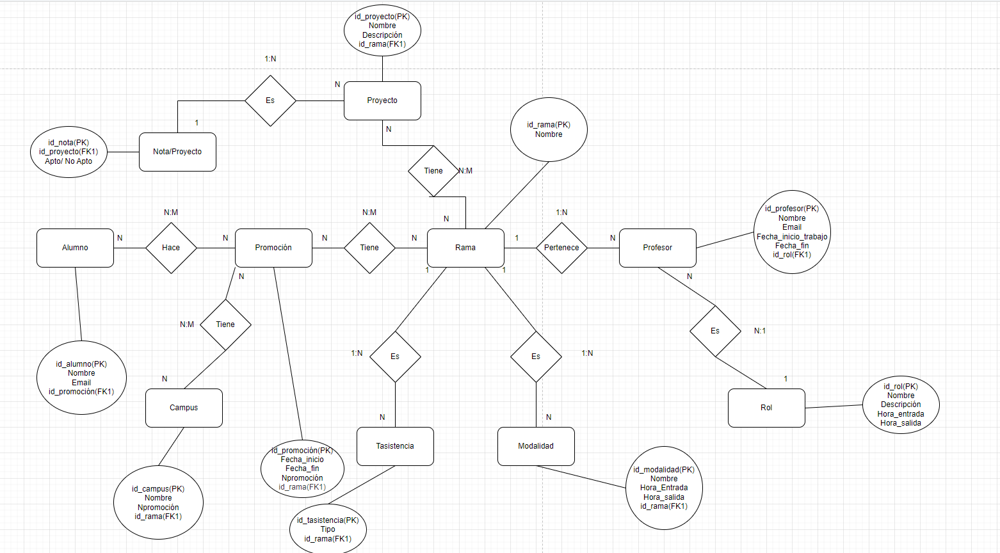
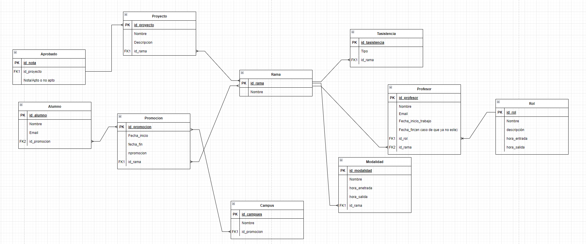

# 📘 Proyecto de Gestión Académica

Este proyecto representa un sistema de gestión académica que organiza información sobre alumnos, promociones, proyectos, profesores, asistencias, y más, todo categorizado por **ramas educativas**. El sistema ha sido diseñado siguiendo buenas prácticas de modelado de datos y utilizando herramientas modernas para su desarrollo y despliegue.

---

## 🛠️ Tecnologías utilizadas

- **🔧 Backend / Base de datos:**
  - PostgreSQL (administrado con **pgAdmin 4**)
- **📦 Contenedores:**
  - **Docker** (para la gestión y orquestación de servicios como PostgreSQL y pgAdmin)
- **📐 Modelado:**
  - **Draw.io** para el diseño del modelo entidad-relación (MER) y modelo relacional (físico)
- **🚀 Despliegue:**
  - **Render** como plataforma de hosting para el entorno de producción

---

<h2>🧩 Modelo Entidad-Relación </h2>

### Principales entidades:

- `Alumno`: Persona que forma parte de una o más promociones.
- `Promoción`: Representa una cohorte de alumnos para un periodo específico.
- `Proyecto`: Trabajo que puede estar relacionado con una rama y evaluado con nota.
- `NotaProyecto`: Indica si el proyecto ha sido aprobado o no.
- `Profesor`: Personal docente vinculado a una rama y con un rol específico.
- `Rol`: Define funciones del profesor.
- `Rama`: Especialidad académica.
- `Modalidad`: Define si una rama es presencial, online, etc., con horarios establecidos.
- `Asistencia`: Registro de asistencia a actividades por rama.
- `Campus`: Sede física donde se imparten promociones.

---

<h2> 🧮 Modelo Relacional </h2>

### Relaciones destacadas:

- `Alumno` **↔** `Promoción`: Relación **N:M** mediante la tabla intermedia.
- `Promoción` **↔** `Campus`: Relación **N:M**.
- `Promoción` **↔** `Rama`: Relación **N:M**.
- `Proyecto` **↔** `NotaProyecto`: Relación **1:1** para evaluación.
- `Profesor` **↔** `Rol`: Cada profesor tiene un rol, relación **N:1**.
- `Rama` tiene relación con:
  - `Proyecto`, `Promoción`, `Modalidad`, `Asistencia`, `Profesor`

---

## 📝 Autores y Créditos

Este proyecto ha sido desarrollado por un equipo de 4 integrantes como parte de un trabajo académico:

- 👤 Alejandro Plaza García
- 👤 Kenyer Villegas
- 👤 Pau Montañés Pla
- 👤 Jonathan Moran Cabrejas

Modelado de base de datos, diseño de relaciones y despliegue gestionado de manera colaborativa.

---

## 📄 Licencia

Este proyecto se distribuye bajo la licencia [MIT](https://opensource.org/licenses/MIT).  
Puedes usarlo libremente con fines académicos o de aprendizaje.

---